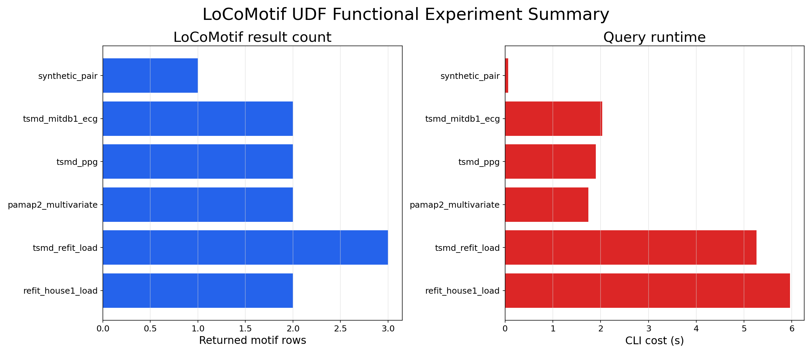
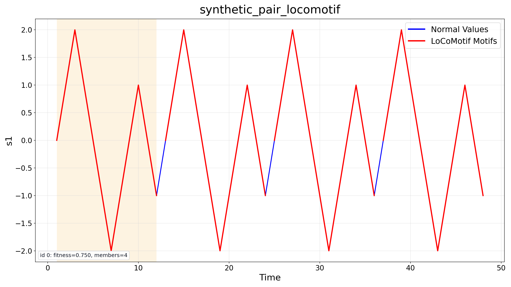
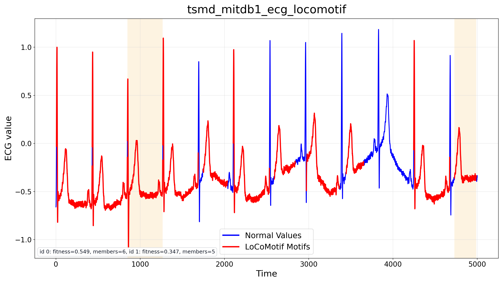
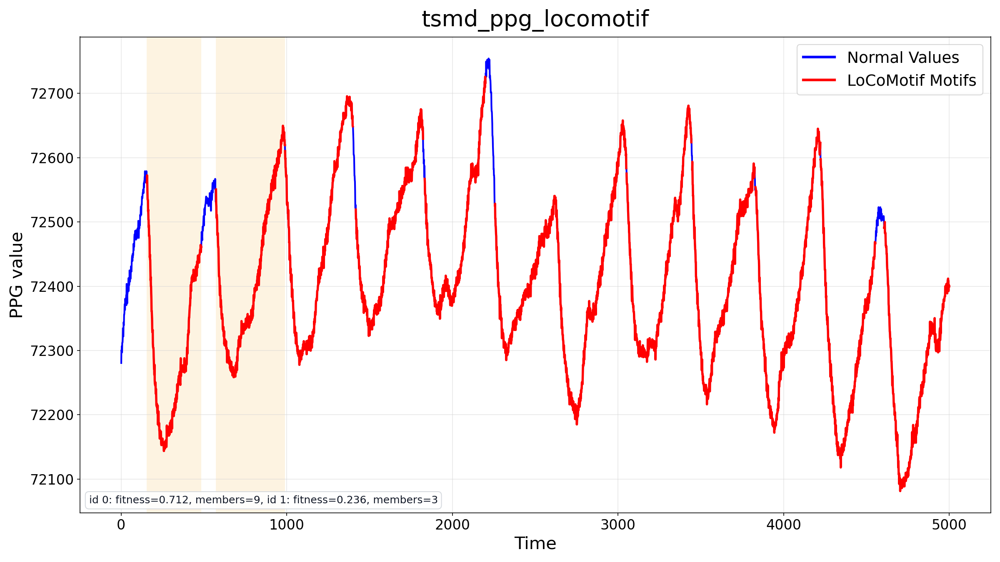
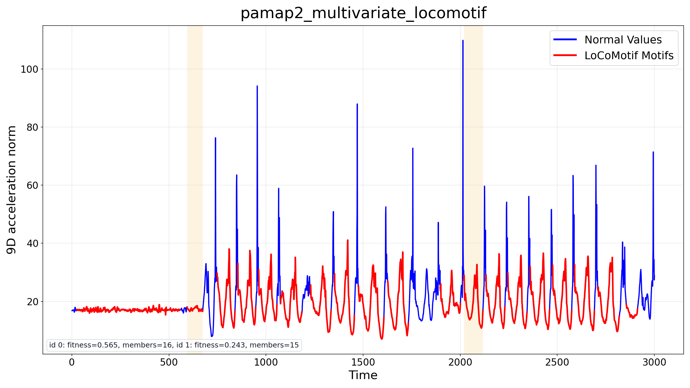
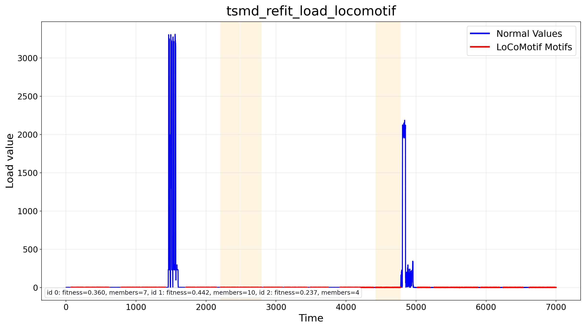
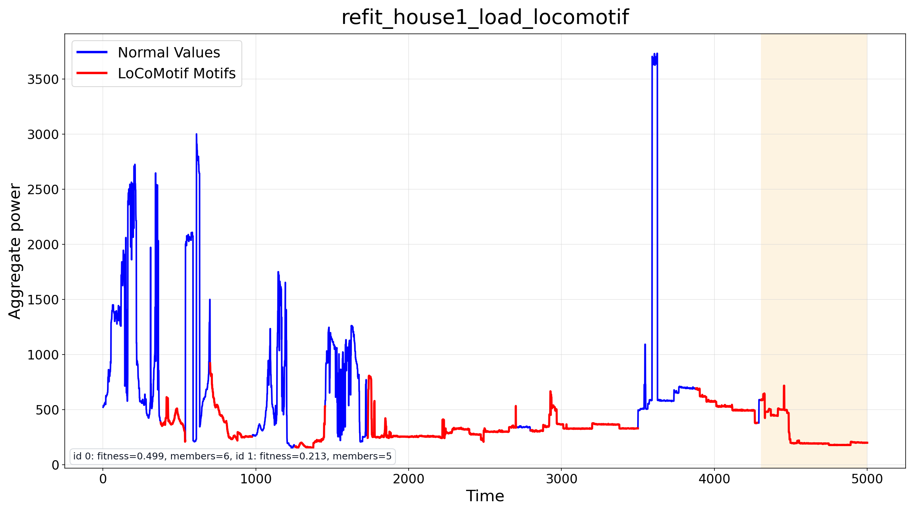

# LoCoMotif UDF 功能实验图示

- 实验目录: `/Users/alan671/Documents/iotdb-release/iotdb/udf-report/locomotif-functional/20260605152211`
- 数据目录: `/Users/alan671/Documents/iotdb-release/datasets/locomotif-udf/small`
- 蓝色曲线表示原始序列，红色曲线表示 LoCoMotif 返回的 motif member 区间。
- 橙色半透明背景表示每个 motif 的 representative 区间。

## 汇总

## 分数据集结果

### `synthetic_pair`

合成双变量重复片段，图中展示 s1 通道。

### `tsmd_mitdb1_ecg`

TSMD mitdb1_0 ECG 单变量序列。

### `tsmd_ppg`

TSMD ppg_0 PPG 单变量序列。

### `pamap2_multivariate`

PAMAP2 9 维 IMU 加速度输入，图中展示 9D L2 norm。

### `tsmd_refit_load`

TSMD REFIT refit_0 负载序列切片。

### `refit_house1_load`

REFIT House1 多变量输入，图中展示 Aggregate 通道。

